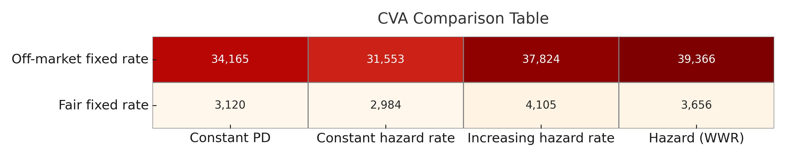

# CVA Simulation Project

This project simulates and evaluates the Credit Valuation Adjustment (CVA) of an interest rate swap under various credit risk assumptions, including market-driven default intensities (Wrong-Way Risk).

## 📌 Objectives

- Simulate short-term interest rates using Brownian motion
- Build a zero-coupon yield curve from historical swap rates (FRED)
- Price a vanilla IRS (fixed vs floating leg)
- Compute Expected Exposure (EE) and Potential Future Exposure (PFE)
- Calculate CVA under:
  - Constant default probability
  - Constant hazard rate
  - Increasing hazard rate
  - Hazard rate linked to market (WWR)
- Visualize and compare results through exposure profiles and a final CVA summary table

## 🗂️ Data Source

The historical swap rates used to build the yield curve were retrieved from the [Federal Reserve Economic Data (FRED)](https://fred.stlouisfed.org/), specifically:
- 1-Year Swap Rate (`MSWP1`)
- 2-Year Swap Rate (`MSWP2`)
- 5-Year Swap Rate (`MSWP5`)
- 10-Year Swap Rate (`MSWP10`)
- 30-Year Swap Rate (`MSWP30`)

These monthly rates cover the period from **July 2000 to September 2016** and were used to calibrate the initial zero-coupon yield curve and estimate volatility and drift for simulation.

## 🛠️ Tools Used

- Python (NumPy, Pandas, Matplotlib)
- Jupyter Notebook
- Data: Federal Reserve Economic Data (FRED)

## 📂 Files

- `CVA_Modeling.ipynb`: full notebook with all simulations, models, and visualizations

## 🔍 Preview

## 🧠 Author

Daniel OSSE – May 2025
